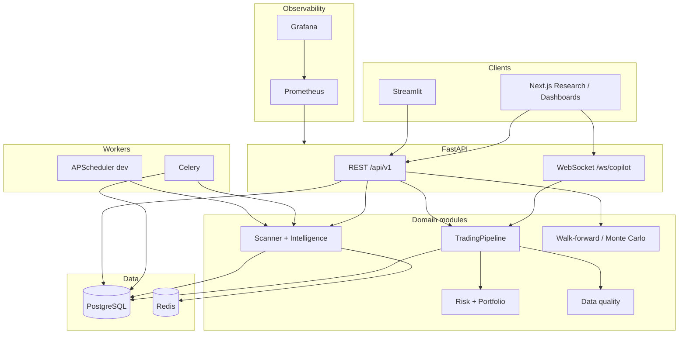
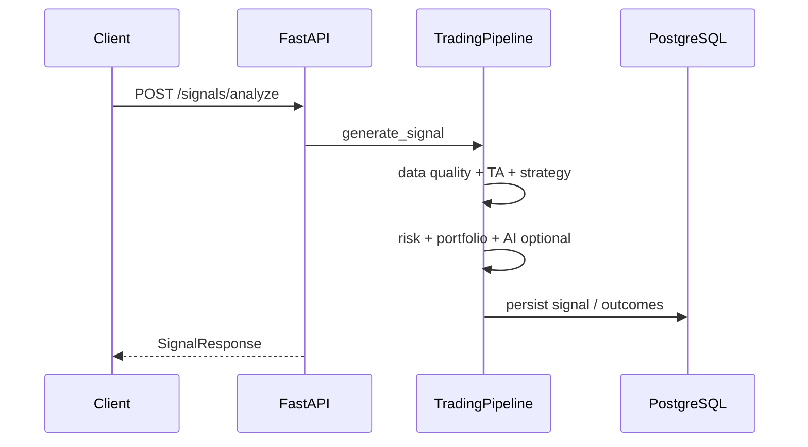

# Architecture diagram

High-level system view (Mermaid). **No deployment topology** — logical only.

```mermaid
flowchart TB
  subgraph clients["Clients"]
    NEXT[Next.js Research / Dashboards]
    ST[Streamlit]
  end

  subgraph api["FastAPI"]
    REST[REST /api/v1]
    WS[WebSocket /ws/copilot]
  end

  subgraph workers["Workers"]
    CEL[Celery]
    APS[APScheduler dev]
  end

  subgraph core["Domain modules"]
    PIPE[TradingPipeline]
    SCAN[Scanner + Intelligence]
    VAL[Walk-forward / Monte Carlo]
    RISK[Risk + Portfolio]
    DQ[Data quality]
  end

  subgraph data["Data"]
    PG[(PostgreSQL)]
    RD[(Redis)]
  end

  subgraph obs["Observability"]
    PROM[Prometheus]
    GRAF[Grafana]
  end

  NEXT --> REST
  ST --> REST
  NEXT --> WS
  WS --> PIPE
  REST --> PIPE
  REST --> SCAN
  REST --> VAL
  CEL --> SCAN
  CEL --> PG
  APS --> SCAN
  PIPE --> RISK
  PIPE --> DQ
  PIPE --> PG
  SCAN --> PG
  SCAN --> RD
  REST --> PG
  PROM --> api
  GRAF --> PROM
```

## Request path (signal)

```mermaid
sequenceDiagram
  participant C as Client
  participant API as FastAPI
  participant P as TradingPipeline
  participant DB as PostgreSQL

  C->>API: POST /signals/analyze
  API->>P: generate_signal
  P->>P: data quality + TA + strategy
  P->>P: risk + portfolio + AI optional
  P->>DB: persist signal / outcomes
  API-->>C: SignalResponse
```
