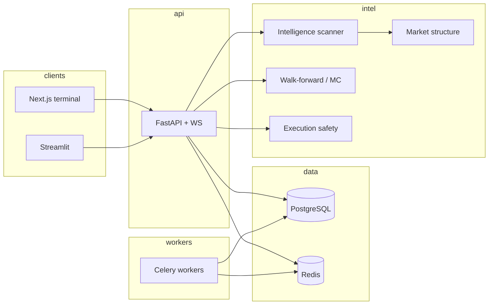

# Final system overview

**AI Trading Copilot Platform v4.0.2** — conservative, research-first, execution-off by default.

## One-page map

## Principles (non-negotiable)

- **No profit guarantees**; evidence and survivability over activity.
- **Execution disabled** unless explicitly enabled with capital safety gates.
- **Data quality** reduces confidence or blocks when feeds are unreliable.

## Entry points

| Surface | Path / URL |
|---------|------------|
| API | `/api/v1/*`, `/api/v1/health` |
| WebSocket | Copilot stream (see API docs) |
| Metrics | `/metrics` (protect in prod) |
| Dashboards | Grafana JSON under `monitoring/grafana/dashboards/` |

## Documentation spine

Start at **[MASTER_OPERATIONS_INDEX.md](./MASTER_OPERATIONS_INDEX.md)**. Post-release change policy: **[FINAL_STABLE_RELEASE_CHARTER.md](./FINAL_STABLE_RELEASE_CHARTER.md)**.

## Version & freeze

- **v4.0.2** — institutionalization complete; **architecture freeze** for expansion; ongoing **stability, security, and ops** only.
