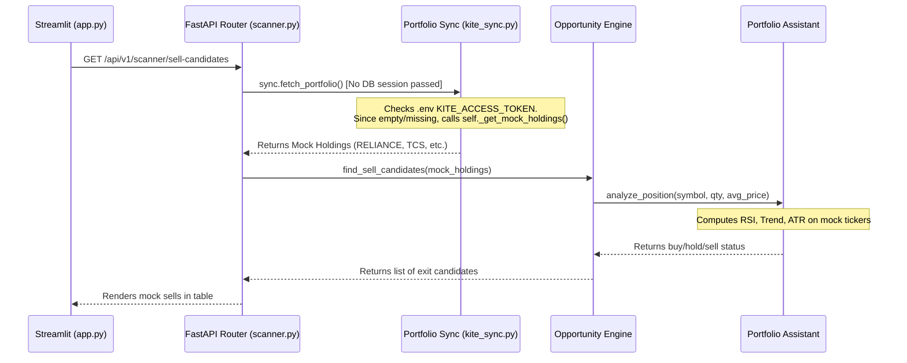

# Portfolio Intelligence Audit

This report audits the Portfolio Assistant's recommendation logic (BUY/HOLD/REDUCE/EXIT) and traces the exact code paths to determine if recommendations are run on actual holdings or mock portfolios.

---

## Recommendation Rules Matrix

The recommendation engine is housed in `backend/app/modules/portfolio/assistant.py`. The rules are hardcoded as follows:

| Recommendation | Conditions Met | Actionable Advice in Hinglish |
| :--- | :--- | :--- |
| **BUY** | Trend is `bullish` and RSI <= 72 | *"Strong bullish structure... Adding/buying shares is recommended."* |
| **HOLD** | (Trend is `bullish` and RSI > 72) OR (Trend is `neutral`/sideways) | *"Trend is strong but RSI indicates overbought... Hold your position."* |
| **REDUCE** | Trend is `bearish` AND unrealized P&L is above -8% AND risk score <= 75 | *"Bearish trend structure forming. Trim your holdings/quantity."* |
| **EXIT** (Sell) | Trend is `bearish` AND (unrealized P&L < -8% OR risk score > 75) | *"Stop-loss margin exceeded... Exiting position highly recommended."* |

---

## Verification: Real vs. Mock Data

> [!WARNING]
> **BRUTAL REALITY:** All portfolio recommendations on the dashboard opportunities panel are generated from **B) MOCK PORTFOLIO DATA**.
> 
> Unless you have manually configured `BROKER_MODE=kite` and a hardcoded, unexpired `KITE_ACCESS_TOKEN` in the static `.env` file, the system is completely incapable of analyzing your father's real holdings. It silently evaluates the five fallback assets (`RELIANCE`, `TCS`, `INFY`, `HDFCBANK`, `ITC`).

---

## Exact Code Path Trace

Here is the exact code execution sequence when your father clicks **"Identify Top Exit/Sell Candidates"** on the Streamlit dashboard:



### 1. API Route Entry
* **File:** `backend/app/api/routes/scanner.py` [L203-212](file:///d:/AI%20Trading/backend/app/api/routes/scanner.py#L203-L212)
* **Code:**
  ```python
  @router.get("/sell-candidates")
  async def get_sell_candidates() -> list[dict]:
    sync = KitePortfolioSync()
    portfolio_data = await sync.fetch_portfolio() # <-- CRITICAL: Ignored DB, uses mock fallback
    engine = OpportunityEngine()
    return await engine.find_sell_candidates(portfolio_data.get("holdings", []))
  ```

### 2. Portfolio Fallback Dispatch
* **File:** `backend/app/modules/portfolio/kite_sync.py` [L67-72](file:///d:/AI%20Trading/backend/app/modules/portfolio/kite_sync.py#L67-L72)
* **Code:**
  ```python
  except Exception as e:
    logger.error("kite_live_sync_failed_using_fallback", error=str(e))
    holdings = await self._get_mock_holdings()
  else:
    # Use mock holdings directly for development mode
    holdings = await self._get_mock_holdings() # <-- CRITICAL: Silent mock fallback
  ```

### 3. Quantitative Recommendation Execution
* **File:** `backend/app/modules/portfolio/assistant.py` [L98-115](file:///d:/AI%20Trading/backend/app/modules/portfolio/assistant.py#L98-L115)
* **Code:**
  ```python
  if snap_daily.trend_direction == "bullish":
    if snap_daily.rsi > 72:
      status = "HOLD"
    else:
      status = "BUY"
  elif snap_daily.trend_direction == "bearish":
    if pnl_pct < -8.0 or risk_score > 75:
      status = "EXIT"
    else:
      status = "REDUCE"
  ```
